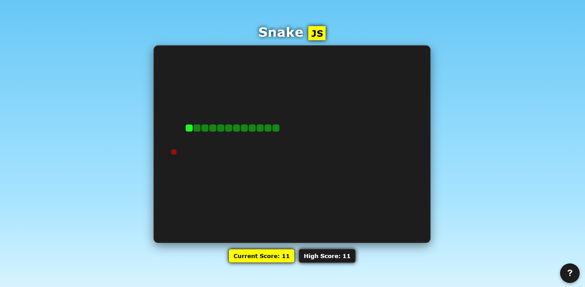

# Snake JS

A classic Snake game built from scratch with vanilla JavaScript, HTML, and CSS.

## Preview

## Features

- Snake movement with arrow keys and WASD
- Frame-based direction input
- Food spawning
- Snake growth
- Wall collision
- Self-collision
- Game-over screen
- Restart without refreshing the page
- Canvas-based rendering
- GitHub info tooltip

## Tech Stack

- HTML
- CSS
- JavaScript
- HTML Canvas
