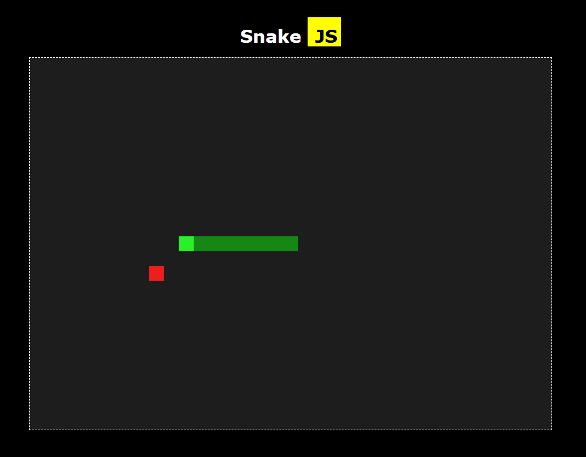

# Snake JS

A classic Snake game built from scratch with vanilla JavaScript, HTML, and CSS.

## Preview

## Features

- Snake movement with arrow keys
- Food spawning
- Snake growth
- Wall collision
- Self-collision
- Canvas-based rendering

## Tech Stack

- HTML
- CSS
- JavaScript
- HTML Canvas
